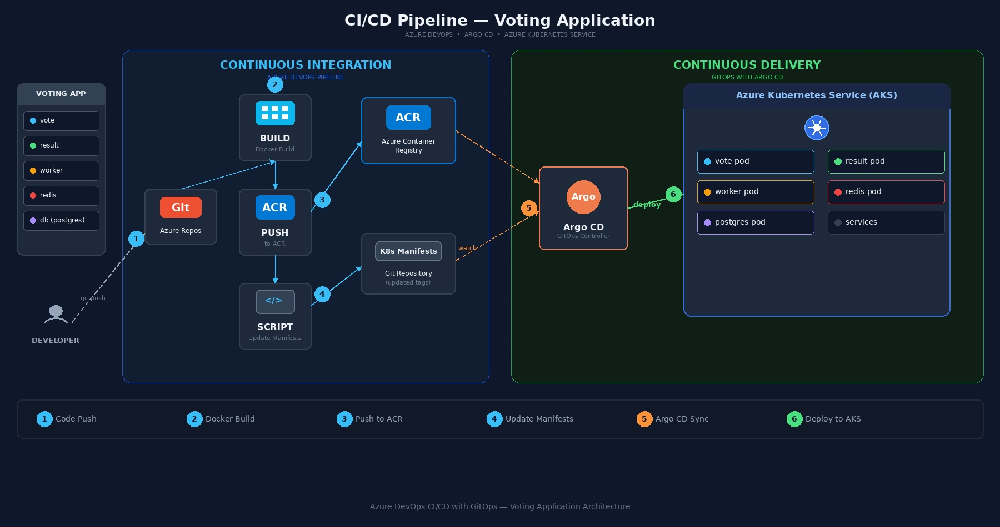
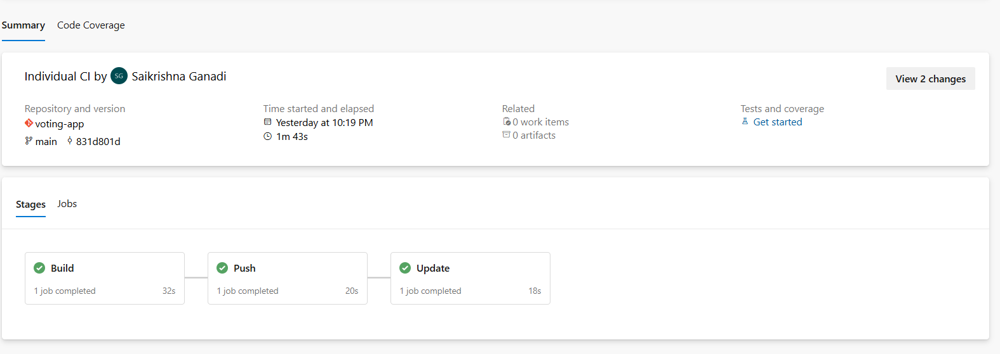
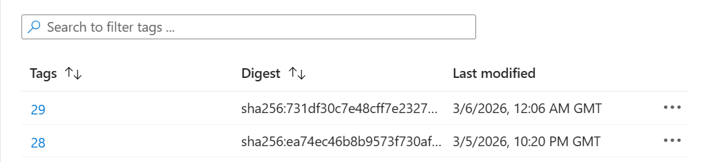
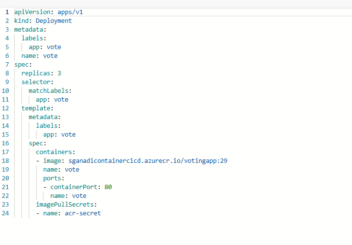
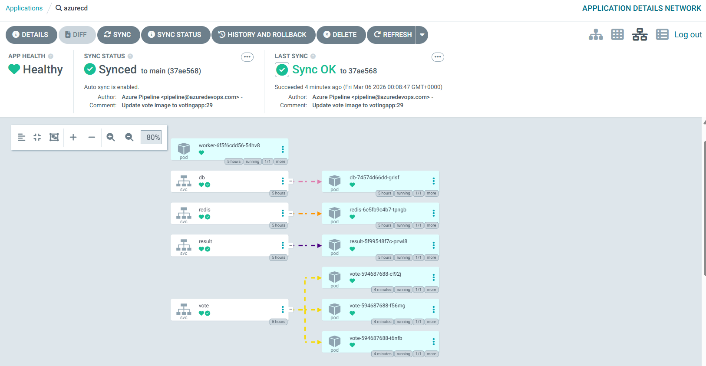
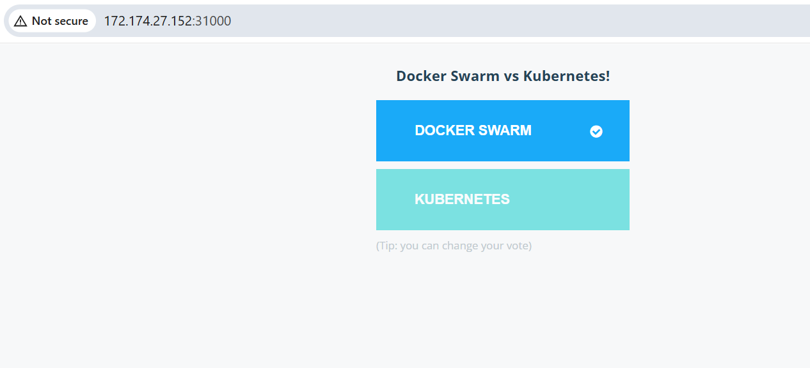

# Azure DevOps CI/CD with GitOps — Voting Application

A complete end-to-end CI/CD pipeline built using **Azure DevOps**, **Argo CD**, and **Azure Kubernetes Service (AKS)** to deploy a microservices-based voting application using GitOps principles.



---

## Tech Stack

| Tool | Purpose |
|------|---------|
| Azure Repos | Source code repository |
| Azure Pipelines | CI pipeline (Build, Push, Update) |
| Azure Container Registry (ACR) | Docker image storage |
| Azure Kubernetes Service (AKS) | Kubernetes cluster |
| Argo CD | GitOps-based continuous delivery |
| Docker | Containerization |

---

## Application Overview

The Voting App is a microservices application composed of 5 services:

| Service | Language | Description |
|---------|----------|-------------|
| **vote** | Python | Frontend — lets users vote between two options |
| **result** | Node.js | Frontend — displays voting results in real time |
| **worker** | .NET | Backend — processes votes from Redis and stores in Postgres |
| **redis** | Redis | In-memory data store for collecting votes |
| **db** | PostgreSQL | Persistent database for storing votes |

**Flow:** User votes via the `vote` app → vote is stored in `redis` → `worker` picks it up from `redis` and stores it in `postgres` → `result` app reads from `postgres` and displays results.

Source: [dockersamples/example-voting-app](https://github.com/dockersamples/example-voting-app)

---

## Architecture

The project is split into two parts:

### Continuous Integration (Azure DevOps Pipelines)

Developer pushes code → Azure Pipeline triggers → Docker image is built → Pushed to ACR → Shell script updates K8s manifest with new image tag

### Continuous Delivery (GitOps with Argo CD)

Argo CD watches the Git repo for manifest changes → Detects updated image tag → Automatically deploys to AKS cluster

---

## Project Setup — Step by Step

### 1. Migrate Source Code to Azure DevOps

1. Create an **Azure DevOps Organization** at [dev.azure.com](https://dev.azure.com)
2. Create a new **Project** (e.g., `voting-app`) → Private → Create
3. Go to **Repos** → Import Repository → paste the GitHub repo URL
4. Change default branch to `main` (set as default branch)

### 2. Create Azure Container Registry (ACR)

1. Go to **Azure Portal** → Create a resource → Container Registry
2. Name: `sganadicontainercicd` (or your preferred name)
3. Resource Group: Create new (e.g., `azurecicd`)
4. SKU: Basic
5. Click **Create**

### 3. Create a Self-Hosted Agent

Since we're using a self-hosted agent pool instead of Microsoft-hosted agents:

1. **Create a Virtual Machine** in the same resource group
2. SSH into the VM:
   ```bash
   ssh -i ~/azureagent_key.pem azureuser@<VM_PUBLIC_IP>
   ```
3. Set up the agent:
   ```bash
   mkdir myagent && cd myagent
   # Download and extract the agent (upload via scp or curl)
   tar zxvf vsts-agent-linux-x64-4.269.0.tar.gz
   ```
4. Configure the agent:
   ```bash
   ./config.sh
   # Server URL: https://dev.azure.com/<your-org>
   # PAT: Generate from Azure DevOps → User Settings → Personal Access Tokens
   # Agent Pool: azureagent
   ```
5. Install Docker on the VM:
   ```bash
   sudo apt-get update
   sudo apt-get install docker.io -y
   sudo usermod -aG docker azureuser
   sudo systemctl restart docker
   ```
6. Run the agent as a service:
   ```bash
   sudo ./svc.sh install
   sudo ./svc.sh start
   ```
7. In Azure DevOps, go to **Organization Settings → Agent Pools → Add Pool** → Self-hosted → Name: `azureagent` → Grant access to all pipelines

### 4. Create CI Pipelines

We create **3 separate pipelines** — one for each microservice (vote, result, worker) — using **path-based triggers** so each pipeline only runs when its corresponding service folder changes.

#### Pipeline Structure

Each pipeline has 3 stages:

```
Build → Push → Update
```

#### Example: Vote Service Pipeline (`azure-pipelines-vote.yml`)

See [`azure-pipelines-vote.yml`](azure-pipelines-vote.yml) for the full pipeline configuration.

Each pipeline has 3 stages:
- **Build** — Docker builds the image using the service's Dockerfile
- **Push** — Pushes the image to ACR with `BuildId` as the tag
- **Update** — Inline Bash script clones the repo, updates the K8s manifest with the new image tag using `sed`, and pushes the change back

> **Important Notes:**
> - Store the PAT as a **secret pipeline variable**, never hardcode it
> - Use **inline Bash@3 task** instead of ShellScript@2 to avoid Windows CRLF line ending issues
> - Each microservice gets its own pipeline with its own path trigger

#### Pipeline Result



All 3 stages complete successfully: Build (32s) → Push (20s) → Update (18s)

### 5. Verify Images in ACR

After the pipeline runs, verify images are pushed to ACR:

```bash
az acr repository list --name sganadicontainercicd --output table
az acr repository show-tags --name sganadicontainercicd --repository votingapp --output table
```



### 6. Verify K8s Manifest Update

The Update stage automatically modifies the deployment YAML with the new image tag:



```yaml
containers:
- image: sganadicontainercicd.azurecr.io/votingapp:29
  name: vote
  ports:
  - containerPort: 80
    name: vote
imagePullSecrets:
- name: acr-secret
```

---

## Continuous Delivery Setup

### 7. Create AKS Cluster

1. Go to **Azure Portal** → Kubernetes Services → Create
2. Same resource group as above
3. Cluster name: `azuredevops`
4. Node pool: min 1, max 2 nodes
5. Max pods per node: 30
6. Enable public IP
7. Click **Create**

Connect to the cluster:

```bash
az aks get-credentials --name azuredevops --overwrite-existing --resource-group azurecicd
```

### 8. Install Argo CD

```bash
kubectl create namespace argocd
kubectl apply -n argocd -f https://raw.githubusercontent.com/argoproj/argo-cd/stable/manifests/install.yaml
kubectl get pods -n argocd
```

### 9. Access Argo CD UI

Change the service type from ClusterIP to NodePort:

```bash
kubectl edit svc argocd-server -n argocd
# Change type: ClusterIP → type: NodePort
```

Get the external IP and port:

```bash
kubectl get nodes -o wide          # Get external IP
kubectl get svc -n argocd          # Get NodePort
```

Open the port in the VMSS Network Security Group (NSG) in Azure Portal.

Get the initial admin password:

```bash
kubectl get secret argocd-initial-admin-secret -n argocd -o jsonpath="{.data.password}" | base64 --decode
```

Login: `admin` / `<decoded password>`

### 10. Connect Argo CD to Azure Repos

1. In Argo CD UI → **Settings → Repositories → Connect Repo**
2. Connection method: HTTPS
3. Type: git
4. Project: default
5. Repo URL: `https://<PAT>@dev.azure.com/<org>/voting-app/_git/voting-app`
   - Replace the org name in URL with PAT for authentication
6. Verify connection is **Successful**

### 11. Create Argo CD Application

1. Click **New App**
2. Application Name: `azurecd`
3. Project: `default`
4. Sync Policy: **Automatic**
5. Repo URL: Select the connected repo
6. Path: `k8s-specifications`
7. Cluster: `https://kubernetes.default.svc`
8. Namespace: `default`
9. Click **Create**

### 12. Create Image Pull Secret

Since ACR is a private registry, K8s needs credentials to pull images:

```bash
kubectl create secret docker-registry acr-secret \
  --docker-server=sganadicontainercicd.azurecr.io \
  --docker-username=<ACR_USERNAME> \
  --docker-password=<ACR_PASSWORD>
```

Get ACR credentials:

```bash
az acr credential show --name sganadicontainercicd
```

Add `imagePullSecrets` to your deployment YAMLs:

```yaml
spec:
  containers:
  - image: sganadicontainercicd.azurecr.io/votingapp:29
    name: vote
  imagePullSecrets:
  - name: acr-secret
```

### 13. Speed Up Argo CD Reconciliation

By default, Argo CD checks for changes every 180 seconds. To reduce to 10 seconds:

```bash
kubectl edit cm argocd-cm -n argocd
```

Add under `data:`:

```yaml
data:
  timeout.reconciliation: 10s
```

---

## Final Result

### Argo CD Dashboard — All Services Healthy



All pods are running and healthy: vote (3 replicas), result, worker, redis, db.

### Voting Application — Live



Application accessible at `<NodeIP>:31000` — fully functional voting between Docker Swarm vs Kubernetes.

---

## End-to-End Flow

```
Developer pushes code to vote/ folder
        ↓
Azure Pipeline triggers (path-based)
        ↓
Stage 1: BUILD — Docker builds the image
        ↓
Stage 2: PUSH — Image pushed to ACR with BuildId tag
        ↓
Stage 3: UPDATE — Script updates vote-deployment.yaml with new image tag
        ↓
Argo CD detects manifest change in Git repo
        ↓
Argo CD syncs and deploys updated image to AKS
        ↓
New version is live on the cluster
```

---

## Troubleshooting Notes

| Issue | Solution |
|-------|----------|
| SSH key `Permission denied` on WSL | Copy key to `~/` (Linux filesystem), run `chmod 600` — NTFS doesn't support Linux permissions |
| Shell script `$'\r': command not found` | Windows CRLF line endings — use inline Bash@3 task instead of ShellScript@2 |
| `git push` fails in Update stage | Ensure PAT has Code (Read & Write) scope |
| Agent offline | Run `sudo ./svc.sh start` on the VM |
| Argo CD shows old image tag | Check reconciliation timeout, or manually click Sync → Refresh |
| `imagePullSecrets` error | Ensure `acr-secret` exists in the same namespace as the deployment |
| Pipeline queued indefinitely | Only one agent — cancel stuck jobs, or add `batch: true` to trigger |

---

## Key Learnings

1. **Path-based triggers** ensure only the relevant pipeline runs when a specific microservice changes
2. **Self-hosted agents** require Docker installed and proper permissions
3. **GitOps with Argo CD** provides continuous reconciliation — Git is the single source of truth
4. **CRLF issues** are common when editing shell scripts on Windows — always use inline scripts or `dos2unix`
5. **Secrets management** — never hardcode PATs; use pipeline secret variables
6. **imagePullSecrets** are required when pulling from private container registries
7. **Migrating from GitHub to Azure DevOps** — experience migrating source code, pipelines, and CI/CD workflows from GitHub to Azure      Repos and Azure Pipelines, including importing repositories, reconfiguring triggers, and setting up service connections
---

## Cleanup

To avoid Azure charges, delete resources when done:

```bash
# Delete resource group (removes VM, AKS, ACR, etc.)
az group delete --name azurecicd --yes

# Verify no leftover resources
az resource list --output table
az disk list --output table
az network public-ip list --output table
```

---

## Author

**Saikrishna Ganadi** — [LinkedIn](https://www.linkedin.com/in/saikrishna-ganadi/)

Built as a hands-on DevOps project implementing CI/CD with Azure DevOps and GitOps principles.
